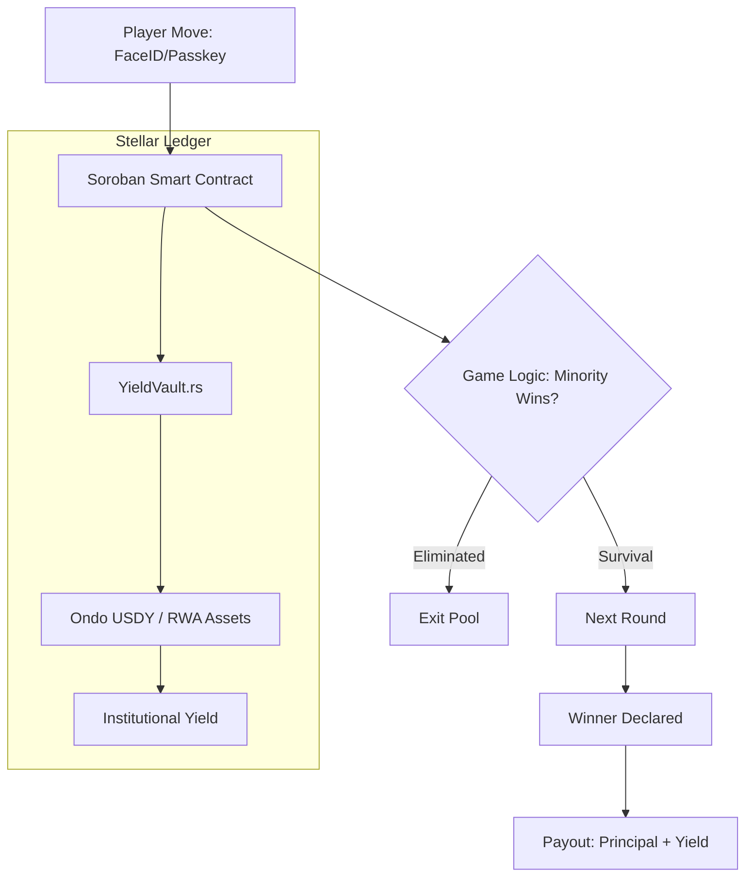

#  INVERSE ARENA

**The RWA-Powered multiplayer blockchain elimination game where the minority wins. Built on the Stellar Network.**

[](https://stellar.org)
[](https://soroban.stellar.org)

**Inverse Arena** is a high-stakes "Last Man Standing" prediction game where players compete by making binary choices (Heads or Tails). The twist: players who choose the **minority option** advance, while the majority are eliminated.

While players battle psychologically, their entry fees are never idle. Built on **Stellar**, Inverse Arena automatically routes prize pools into **Real-World Asset (RWA)** protocols to generate institutional-grade yield during gameplay.

---

## 🎯 The Problem

### 1. The GameFi Sustainability Crisis

Most Web3 games rely on inflationary token emissions to reward players. When new player growth slows, the token value crashes, the economy collapses, and the project fails. Investors are tired of "Ponzinomics" that lack a real revenue floor.

### 2. The Idle Capital Inefficiency

Currently, billions in GameFi TVL (Total Value Locked) sits stagnant in smart contracts. While players and stakers wait for matches or progress through levels, their capital earns $0 interest. This is a massive opportunity cost for users and a waste of liquidity for the ecosystem.

### 3. The "Majority-Rule" Boredom

Traditional prediction games often reward the majority, leading to "herd behavior" and low-stakes excitement. There is a lack of high-tension, contrarian gameplay that rewards strategic intuition and psychological play, leading to stagnant retention rates.

### 4. Fragmented UX & Value Friction

Players face a "dead-air" problem: long matchmaking wait times with no value accrual. If a player waits 10 minutes for a game to start, they have lost both time and potential yield. Current platforms fail to bridge the gap between DeFi earning and active gaming.

---

## 💡 Solution

1. RWA-Powered Prize Pools: Player stakes ($USDTO$) are never idle. They are immediately routed into institutional-grade, yield-bearing Real-World Assets. The prize pool grows every second the game is active.

2. The "Contrarian" Game Engine: A high-tension PvP survival game where you only survive if you choose the minority side. It’s a psychological battle that rewards strategy over herd behavior.

3. Mantle Modular Speed: Leveraging Mantle’s low fees and high throughput to ensure instant matchmaking and seamless, low-cost "Head or Tails" rounds.

4. Sustainable Rewards: Unlike other games, our rewards aren't "printed" they are harvested from real-world yield, creating a non-inflationary, long-term economic model.

---

## ⚡ Why Stellar & Soroban?

In 2026, Stellar is the premier choice for Inverse Arena due to:

- **Ultra-Fast Finality**: Ledger settlement in 2-5 seconds—essential for fast-paced elimination rounds
- **Near-Zero Fees**: Transaction costs are roughly 0.00001 XLM, allowing for micro-stake games
- **Native RWA Ecosystem**: Direct access to yield-bearing assets like Ondo USDY and tokenized Treasury bills
- **Passkey Support**: Players can sign "Heads" or "Tails" moves using FaceID or TouchID, removing the need for seed phrases

---

## 💎 Real-World Asset Integration

Traditional GameFi prize pools are stagnant. Inverse Arena turns capital into a productive asset:

- **USDY (Ondo Finance)**: Entry fees in USDC are swapped to USDY to earn ~5% APY from US Treasuries
- **Yield-Bearing Anchors**: Leveraging Stellar's "Anchor" network to tap into global fiat-backed yields
- **Sustainable Rewards**: Winnings are paid out as Principal + Accumulated Yield, creating a non-inflationary economic model

---

## 🕹️ Game Mechanics

### 1. The "Contrarian" Engine

Players enter a pool. Each round, they must predict what the fewer number of people will choose.

- **Majority Chose Heads?** → Heads are eliminated
- **Minority Chose Tails?** → Tails advance to the next round
- **One Survivor?** → The "Last Man Standing" claims the entire pool + RWA yield

### 2. Pool Lifecycle

- **Creation**: Hosts stake XLM to create a pool
- **Entry**: Players join using USDC, EURC, or XLM
- **Yield Start**: Soroban smart contracts move funds to yield-bearing RWA vaults
- **Resolution**: Rounds execute every 30-60 seconds until a winner is declared

---

## 🏗️ Architecture



### Smart Contract Components (Rust/WASM)

- `arena_manager.rs`: Manages player states, round timing, and elimination logic
- `rwa_adapter.rs`: Interfaces with Stellar Asset Contracts (SAC) to swap and deposit funds into yield protocols
- `random_engine.rs`: Utilizes Stellar's ledger-based entropy for fair round outcomes

---

## 🗺️ Roadmap

### Phase 1: Stellar Testnet (Q1 2026) ✅

- Soroban core logic deployment
- Integration with Stellar Asset Contracts (USDC)
- Alpha testing with 100 concurrent players

### Phase 2: RWA Integration (Q2 2026) ⏳

- Mainnet launch on Stellar
- Integration with Ondo USDY for automated prize pool yield
- MoneyGram "Cash-In" feature for global accessibility

### Phase 3: Expansion (Q3 2026) 🚀

- Mobile app with native Passkey support
- DAO-governed RWA allocation strategies
- Private "Arena" hosting for influencers and brands

---

## 📄 API Pagination

The list APIs use cursor-based pagination with stable ordering by `createdAt DESC, id DESC`.

- **Default page size**: `25`
- **Maximum page size**: `100`
- **Query params**:
  - `limit`: Positive integer, capped at max page size
  - `cursor`: Opaque value returned by a previous page

### Response Shape

```json
{
  "items": [],
  "cursor": "opaque-next-cursor-or-null",
  "hasMore": true
}
```

### Implemented Endpoints

- `GET /arenas/:id/participants`
- `GET /pools/:id/eliminations`

---

## 🌐 Stellar Network Configuration

The Stellar network used by the wallet provider is controlled by an environment variable so you can switch between testnet and mainnet without code changes:

```bash
# "testnet" (default) or "mainnet"
NEXT_PUBLIC_STELLAR_NETWORK=testnet
```

| Value | Stellar Network | When to use |
|-------|----------------|-------------|
| `testnet` (default) | Test SDF Network | Local development, staging |
| `mainnet` | Public Global Stellar Network | Production |

If the variable is missing or empty the app defaults to **testnet**. An unrecognised value logs a console warning and also falls back to testnet.

> **Note:** This is a Next.js public env var — changes require a restart of the dev server (or a new build).

---

## 🔒 Security Configuration

For a full reference of every environment variable used by the frontend and backend, see **[docs/ENVIRONMENT.md](../docs/ENVIRONMENT.md)**.

Set allowed web origins with environment variables so CORS can stay strict and configurable:

```bash
ALLOWED_ORIGINS=https://app.inversearena.io,https://staging.inversearena.io
NEXT_PUBLIC_APP_ORIGIN=https://app.inversearena.io
NEXT_PUBLIC_HORIZON_URL=https://horizon-testnet.stellar.org
NEXT_PUBLIC_SOROBAN_RPC_URL=https://soroban-testnet.stellar.org
```

Optional API override used by telemetry module:

```bash
NEXT_PUBLIC_COINGECKO_SIMPLE_PRICE_URL=https://api.coingecko.com/api/v3/simple/price?ids=cardano&vs_currencies=usd
```

### Security headers & Content-Security-Policy

`src/proxy.ts` sets the response security headers on every non-asset route:

- **Content-Security-Policy** — `script-src` is `'self' 'nonce-<random>'
  'strict-dynamic'` (plus `'unsafe-eval'` in dev for the Next dev runtime).
  There is **no `'unsafe-inline'`**, so an injected inline `<script>` (e.g. via
  a future `dangerouslySetInnerHTML` or a compromised dependency) will not
  execute. A fresh nonce is generated per request and forwarded to the app as
  the `x-nonce` header; `src/app/layout.tsx` reads it and passes it to
  `next-themes` so its inline anti-flash script is allowed. `style-src` keeps
  `'unsafe-inline'` — React inline `style` props depend on it and it is not a
  script-execution vector.
- **Strict-Transport-Security** — `max-age=63072000; includeSubDomains;
  preload`. Instructs browsers to only ever connect over HTTPS, so a
  downgrade/MITM cannot intercept wallet transaction data.

`next.config.ts` applies the same non-CSP headers (including HSTS) statically
to every route, covering the static-asset responses `proxy.ts` does not run
on. The nonce'd CSP makes every route server-rendered on demand (a nonce
cannot be baked into static HTML).

---

## 🚨 Frontend Error Reporting (Sentry)

Unhandled React render errors caught by the `ErrorBoundary` are automatically reported to [Sentry](https://sentry.io) in production.

### How it works

- `sentry.client.config.ts` (project root) initialises the SDK on the browser.
- `src/lib/sentry.ts` exposes `captureReactError()`, called by `ErrorBoundary.componentDidCatch`.
- Each report includes the **React component stack** so you can pinpoint the exact component that threw.
- The existing fallback UI ("Retry / Go Home / Report Issue") is unchanged.

### Setup

1. Create a project in the [Sentry dashboard](https://sentry.io) and copy the **DSN**.
2. Add environment variables to your deployment:

```bash
# Required – reporting is disabled when this is absent (safe for local dev)
NEXT_PUBLIC_SENTRY_DSN=https://<key>@o<org>.ingest.sentry.io/<project>

# Optional – label events by environment in the Sentry dashboard
NEXT_PUBLIC_SENTRY_ENVIRONMENT=production

# Optional – set by CI to the git SHA or semver tag for release tracking
NEXT_PUBLIC_SENTRY_RELEASE=v1.2.3

# Server-only (build time) – needed to upload source maps so stack traces
# show original TypeScript source instead of minified output
SENTRY_AUTH_TOKEN=<token from Sentry Settings → Auth Tokens>
```

3. Deploy. Errors will appear under your project in the Sentry dashboard within seconds.

### Privacy / PII

- `sendDefaultPii` is **disabled** — cookies and auth headers are never attached to events.
- A `beforeSend` scrubber strips all user fields except an opaque anonymous `id`.
- Wallet addresses, private keys, and any other sensitive data must **not** be passed as Sentry context anywhere in the codebase.

### Scope

The `ErrorBoundary` only catches **React render errors**. It does **not** catch:

- Async errors (`Promise` rejections, `setTimeout`)
- Event-handler errors
- Server-side rendering errors

Global `unhandledrejection` / `window.onerror` handlers are a planned follow-up (see issue #183).

---

## ⚡ API Rate Limiting

Sensitive write endpoints are protected with a Redis-backed limiter (`rate-limiter-flexible` + `ioredis`) with keys scoped by IP and optional wallet address.

### Protected Endpoints

- `POST /auth/nonce`

Pool creation is served by the backend API (`POST /api/pools`) and is rate
limited there.

### On Limit Violation

APIs return:

- HTTP `429`
- `Retry-After` response header (seconds)

### Client IP resolution & trusted proxies

Rate-limit buckets are keyed by client IP (plus optional wallet address). The
client IP is taken from `X-Forwarded-For` **only** when `TRUSTED_PROXY_COUNT`
says how many trusted proxies sit in front of the app:

- `TRUSTED_PROXY_COUNT=0` (default) — the app is assumed to be exposed
  directly, so `X-Forwarded-For` / `X-Real-IP` are attacker-controlled and are
  ignored. Every caller shares a single bucket (fail closed). A direct caller
  therefore cannot spoof the header to mint a fresh bucket per request.
- `TRUSTED_PROXY_COUNT=N` (`N ≥ 1`) — the right-most `N` entries of
  `X-Forwarded-For` are treated as appended by our own infrastructure; the real
  client is the entry immediately to their left. Values a client prepends are
  ignored.

Set `TRUSTED_PROXY_COUNT` to match the deployment (`1` behind a single
CDN/proxy, `2` behind `CDN → load balancer`, …).

When `REDIS_URL` is unset the limiter logs a startup warning and falls back to
per-process in-memory counting; the effective global limit then becomes
`points × instance_count`. A startup warning is also logged whenever
`TRUSTED_PROXY_COUNT` is `0`.

### Configuration

Environment variables:

- `REDIS_URL` (required for multi-instance shared limits)
- `TRUSTED_PROXY_COUNT` (default: `0`)
- `RATE_LIMIT_NONCE_PREFIX` (default: `rl:auth:nonce`)
- `RATE_LIMIT_NONCE_POINTS` (default: `5`)
- `RATE_LIMIT_NONCE_WINDOW_SECONDS` (default: `60`)
